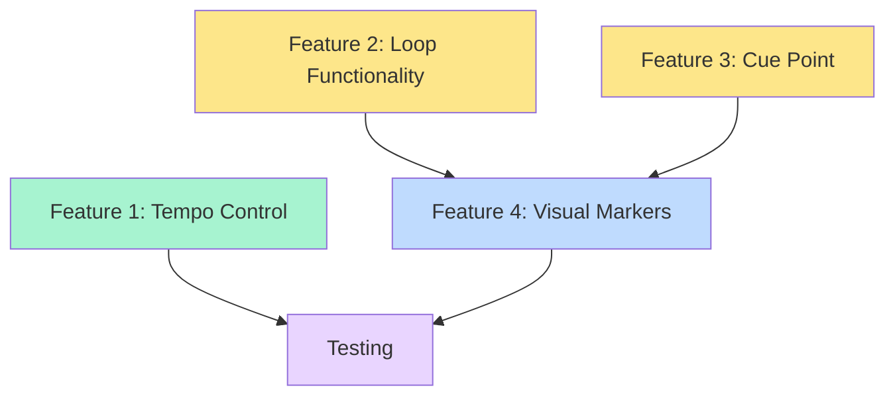

# Phase 4 Implementation Plan: DeckFlow Web

## Overview

This document outlines the implementation plan for Phase 4 of DeckFlow Web, adding DJ-essential features to the existing Phase 3 two-deck mixer. Phase 4 introduces **varispeed tempo control**, **manual loop functionality**, **in-mix cue points**, and **visual markers** on the waveform.

### Current State (Phase 3)
- ✅ Two-deck mixer with crossfader and master volume
- ✅ Per-deck signal chain: 3-band EQ + DJ filter + volume + meter
- ✅ Elementary Audio graph with Web Audio backend
- ✅ Canvas waveform with playhead and zoom
- ✅ Click-to-seek functionality

### Phase 4 Goals
- 🎯 **Varispeed tempo control**: Adjust playback speed (0.5x to 2.0x range)
- 🎯 **Manual loops**: Set loop in/out points with wraparound playback
- 🎯 **Cue point**: Set and jump to a specific position
- 🎯 **Visual markers**: Display cue/loop markers on waveform

### Architecture Impact

```
┌─────────────────────────────────────────────────────────────┐
│                         App.tsx                              │
│  - Manages two decks + crossfader + master                  │
│  - Renders combined audio graph                             │
└─────────────────────────────────────────────────────────────┘
                              │
                              ├─────────────────────────────────┐
                              ▼                                 ▼
                    ┌──────────────────┐            ┌──────────────────┐
                    │   useDeck.ts     │            │   useDeck.ts     │
                    │   (Deck A)       │            │   (Deck B)       │
                    │                  │            │                  │
                    │ NEW in Phase 4:  │            │ NEW in Phase 4:  │
                    │ - tempo state    │            │ - tempo state    │
                    │ - cuePoint       │            │ - cuePoint       │
                    │ - loopIn/Out     │            │ - loopIn/Out     │
                    │ - loopEnabled    │            │ - loopEnabled    │
                    └──────────────────┘            └──────────────────┘
                              │                                 │
                              ▼                                 ▼
                    ┌──────────────────┐            ┌──────────────────┐
                    │    deck.ts       │            │    deck.ts       │
                    │                  │            │                  │
                    │ buildDeckSignal  │            │ buildDeckSignal  │
                    │                  │            │                  │
                    │ NEW in Phase 4:  │            │ NEW in Phase 4:  │
                    │ - tempo scaling  │            │ - tempo scaling  │
                    │ - loop wrapping  │            │ - loop wrapping  │
                    └──────────────────┘            └──────────────────┘
                              │                                 │
                              ▼                                 ▼
                    ┌──────────────────┐            ┌──────────────────┐
                    │  DeckPanel.tsx   │            │  DeckPanel.tsx   │
                    │                  │            │                  │
                    │ NEW in Phase 4:  │            │ NEW in Phase 4:  │
                    │ - Tempo slider   │            │ - Tempo slider   │
                    │ - Cue button     │            │ - Cue button     │
                    │ - Loop controls  │            │ - Loop controls  │
                    └──────────────────┘            └──────────────────┘
                              │                                 │
                              ▼                                 ▼
                    ┌──────────────────┐            ┌──────────────────┐
                    │  Waveform.tsx    │            │  Waveform.tsx    │
                    │                  │            │                  │
                    │ NEW in Phase 4:  │            │ NEW in Phase 4:  │
                    │ - Cue marker     │            │ - Cue marker     │
                    │ - Loop markers   │            │ - Loop markers   │
                    └──────────────────┘            └──────────────────┘
```

---

## Feature 1: Varispeed Tempo Control

### Description
Allow users to adjust playback speed from 0.5x (half speed) to 2.0x (double speed). This is **varispeed**, meaning tempo and pitch change together (no time-stretching).

### Technical Approach

#### State Changes
**File: [`src/deck.ts`](src/deck.ts)**
- The `tempo` field already exists in `DeckState` (currently fixed at 1.0)
- No state structure changes needed

**File: [`src/useDeck.ts`](src/useDeck.ts)**
- Add new action type: `SET_TEMPO`
- Add reducer case to update `tempo` value (clamped 0.5–2.0)
- Add `setTempo` callback function
- Update `LOAD` action to reset tempo to 1.0 on new track

#### Audio Graph Changes
**File: [`src/deck.ts`](src/deck.ts:122)**
- The transport already uses `tempo` in the increment calculation:
  ```typescript
  const incPerSample = s.tempo / Math.max(1, totalFrames - 1);
  ```
- This line already implements varispeed! Just needs UI control.

#### UI Changes
**File: [`src/components/DeckPanel.tsx`](src/components/DeckPanel.tsx)**
- Add tempo slider control (0.5x to 2.0x range)
- Display current tempo value (e.g., "1.00x", "0.85x")
- Position: Below transport controls, above waveform

**File: [`src/components/DeckControls.tsx`](src/components/DeckControls.tsx)** (alternative location)
- Could also add tempo control to the mixer strip
- Consider which location makes more sense for DJ workflow

### Implementation Steps
1. Update [`useDeck.ts`](src/useDeck.ts) reducer with `SET_TEMPO` action
2. Add `setTempo` callback to `UseDeck` interface
3. Add tempo slider UI component to [`DeckPanel.tsx`](src/components/DeckPanel.tsx)
4. Test with audio files at various tempo settings
5. Verify smooth tempo changes without clicks/pops

### Testing Checklist
- [ ] Tempo slider responds smoothly (0.5x to 2.0x)
- [ ] Audio playback speed changes correctly
- [ ] Tempo resets to 1.0 when loading new track
- [ ] No audio artifacts during tempo changes
- [ ] Playhead position updates correctly at different tempos

---

## Feature 2: Manual Loop Functionality

### Description
Allow users to set loop in/out points and enable looping. When enabled, playback wraps from loop-out back to loop-in seamlessly.

### Technical Approach

#### State Changes
**File: [`src/deck.ts`](src/deck.ts:27-39)**
Add to `DeckState` interface:
```typescript
loopEnabled: boolean;
loopInNorm: number;  // normalized position 0..1
loopOutNorm: number; // normalized position 0..1
```

**File: [`src/useDeck.ts`](src/useDeck.ts:20-28)**
Add new action types:
```typescript
| { type: 'SET_LOOP_IN'; norm: number }
| { type: 'SET_LOOP_OUT'; norm: number }
| { type: 'TOGGLE_LOOP' }
| { type: 'CLEAR_LOOP' }
```

#### Audio Graph Changes
**File: [`src/deck.ts`](src/deck.ts:118-149)**

The SPEC.md describes the loop implementation approach (lines 112-116):
- Use **floored modulo** to wrap position into `[loopIn, loopOut)` range
- Formula: `x - len·floor(x/len)` (not `el.mod` which uses `fmod`)
- When loop is toggled off, re-base transport to continue from current position

Implementation in `buildDeckSignal`:
```typescript
// After computing base position
let position = el.add(base, el.accum(inc, seekTrig));

if (s.loopEnabled && s.loopInNorm < s.loopOutNorm) {
  const loopLen = s.loopOutNorm - s.loopInNorm;
  const loopStart = el.const({ key: `${s.id}_loopStart`, value: s.loopInNorm });
  const loopLength = el.const({ key: `${s.id}_loopLen`, value: loopLen });
  
  // Offset position to loop start
  const offset = el.sub(position, loopStart);
  
  // Floored modulo: x - len·floor(x/len)
  const wrapped = el.sub(
    offset,
    el.mul(loopLength, el.floor(el.div(offset, loopLength)))
  );
  
  // Add back loop start
  position = el.add(loopStart, wrapped);
}
```

#### UI Changes
**File: [`src/components/DeckPanel.tsx`](src/components/DeckPanel.tsx)**
Add loop controls:
- **"Set In"** button - captures current position as loop-in
- **"Set Out"** button - captures current position as loop-out
- **"Loop"** toggle button - enables/disables looping
- **"Clear"** button - removes loop points
- Display current loop range (e.g., "Loop: 0:15 → 0:30")

### Implementation Steps
1. Add loop state fields to [`deck.ts`](src/deck.ts) `DeckState`
2. Update [`deck.ts`](src/deck.ts) `initialDeckState` with default loop values
3. Add loop actions to [`useDeck.ts`](src/useDeck.ts) reducer
4. Implement loop wrapping logic in [`deck.ts`](src/deck.ts) `buildDeckSignal`
5. Handle loop exit: when toggling off, update `baseNorm` to current position
6. Add loop control buttons to [`DeckPanel.tsx`](src/components/DeckPanel.tsx)
7. Add loop callbacks to `UseDeck` interface

### Testing Checklist
- [ ] Set loop in/out points at different positions
- [ ] Loop wraps seamlessly from out to in point
- [ ] Loop toggle enables/disables correctly
- [ ] Clear loop removes markers and disables looping
- [ ] Loop works correctly with tempo changes
- [ ] Exiting loop continues playback from current position
- [ ] Loop points persist when pausing/playing

---

## Feature 3: In-Mix Cue Point

### Description
Allow users to set a cue point and jump back to it instantly. Essential for DJ workflow - mark the start of a drop, vocal, or beat.

### Technical Approach

#### State Changes
**File: [`src/deck.ts`](src/deck.ts:27-39)**
Add to `DeckState` interface:
```typescript
cuePointNorm: number | null; // normalized position 0..1, null if not set
```

**File: [`src/useDeck.ts`](src/useDeck.ts:20-28)**
Add new action types:
```typescript
| { type: 'SET_CUE' }        // Set cue at current position
| { type: 'GO_TO_CUE' }      // Jump to cue point
| { type: 'CLEAR_CUE' }      // Remove cue point
```

#### Transport Logic
**File: [`src/useDeck.ts`](src/useDeck.ts:32-54)**

Reducer implementation:
```typescript
case 'SET_CUE':
  return s.track ? { ...s, cuePointNorm: s.baseNorm } : s;

case 'GO_TO_CUE':
  return s.cuePointNorm !== null
    ? { ...s, baseNorm: s.cuePointNorm, seekGen: s.seekGen + 1 }
    : s;

case 'CLEAR_CUE':
  return { ...s, cuePointNorm: null };
```

Note: Use current `baseNorm` for setting cue (not `position` from state, which is async)

#### UI Changes
**File: [`src/components/DeckPanel.tsx`](src/components/DeckPanel.tsx)**
Add cue controls:
- **"Set Cue"** button - marks current position
- **"Cue"** button - jumps to cue point (highlighted when cue is set)
- **"Clear Cue"** button - removes cue point
- Visual indicator showing cue is set (e.g., button color change)

### Implementation Steps
1. Add `cuePointNorm` to [`deck.ts`](src/deck.ts) `DeckState`
2. Update [`deck.ts`](src/deck.ts) `initialDeckState` with `cuePointNorm: null`
3. Add cue actions to [`useDeck.ts`](src/useDeck.ts) reducer
4. Add cue control buttons to [`DeckPanel.tsx`](src/components/DeckPanel.tsx)
5. Add cue callbacks to `UseDeck` interface
6. Ensure cue point is cleared when loading new track

### Testing Checklist
- [ ] Set cue point at various positions
- [ ] Jump to cue point works instantly
- [ ] Cue point persists during playback
- [ ] Clear cue removes the marker
- [ ] Cue point cleared when loading new track
- [ ] Visual feedback shows when cue is set

---

## Feature 4: Visual Markers on Waveform

### Description
Display visual markers on the waveform for cue point and loop in/out points. This provides visual feedback for DJ workflow.

### Technical Approach

#### Component Changes
**File: [`src/components/Waveform.tsx`](src/components/Waveform.tsx)**

Current props:
```typescript
interface Props {
  peaks: TrackPeaks | null;
  position: number;
  onSeek: (norm: number) => void;
}
```

Add new props:
```typescript
interface Props {
  peaks: TrackPeaks | null;
  position: number;
  onSeek: (norm: number) => void;
  cuePoint: number | null;      // NEW
  loopIn: number | null;         // NEW
  loopOut: number | null;        // NEW
  loopEnabled: boolean;          // NEW
}
```

#### Rendering Logic
**File: [`src/components/Waveform.tsx`](src/components/Waveform.tsx:82-126)**

Update the `draw` function to render markers after the waveform but before the playhead:

```typescript
// After blitting the waveform bitmap...

// Draw loop region (if enabled)
if (loopEnabled && loopIn !== null && loopOut !== null) {
  const loopInX = ((loopIn * total - start) / win) * cssW;
  const loopOutX = ((loopOut * total - start) / win) * cssW;
  
  // Semi-transparent overlay
  ctx.fillStyle = 'rgba(76, 194, 255, 0.2)';
  ctx.fillRect(loopInX, 0, loopOutX - loopInX, cssH);
  
  // Loop in marker (green)
  ctx.strokeStyle = '#4ade80';
  ctx.lineWidth = 2;
  ctx.beginPath();
  ctx.moveTo(loopInX, 0);
  ctx.lineTo(loopInX, cssH);
  ctx.stroke();
  
  // Loop out marker (red)
  ctx.strokeStyle = '#f87171';
  ctx.beginPath();
  ctx.moveTo(loopOutX, 0);
  ctx.lineTo(loopOutX, cssH);
  ctx.stroke();
}

// Draw cue point marker (yellow)
if (cuePoint !== null) {
  const cueX = ((cuePoint * total - start) / win) * cssW;
  ctx.strokeStyle = '#fbbf24';
  ctx.lineWidth = 3;
  ctx.beginPath();
  ctx.moveTo(cueX, 0);
  ctx.lineTo(cueX, cssH);
  ctx.stroke();
  
  // Optional: Add triangle marker at top
  ctx.fillStyle = '#fbbf24';
  ctx.beginPath();
  ctx.moveTo(cueX, 0);
  ctx.lineTo(cueX - 5, 10);
  ctx.lineTo(cueX + 5, 10);
  ctx.closePath();
  ctx.fill();
}

// Draw playhead (existing code)...
```

#### Integration
**File: [`src/components/DeckPanel.tsx`](src/components/DeckPanel.tsx:63)**

Update Waveform component usage:
```typescript
<Waveform
  peaks={track?.peaks ?? null}
  position={deck.position}
  onSeek={deck.seek}
  cuePoint={deck.state.cuePointNorm}
  loopIn={deck.state.loopInNorm}
  loopOut={deck.state.loopOutNorm}
  loopEnabled={deck.state.loopEnabled}
/>
```

### Visual Design
- **Cue point**: Yellow vertical line with triangle marker (⚠️)
- **Loop in**: Green vertical line (start of loop)
- **Loop out**: Red vertical line (end of loop)
- **Loop region**: Semi-transparent blue overlay between in/out points
- **Playhead**: Red line (existing, should render on top)

### Implementation Steps
1. Update [`Waveform.tsx`](src/components/Waveform.tsx) Props interface
2. Add marker rendering logic to `draw` function
3. Update [`DeckPanel.tsx`](src/components/DeckPanel.tsx) to pass marker props
4. Test marker visibility at different zoom levels
5. Ensure markers scroll correctly with waveform

### Testing Checklist
- [ ] Cue point marker displays at correct position
- [ ] Loop in/out markers display correctly
- [ ] Loop region overlay shows between markers
- [ ] Markers visible at all zoom levels
- [ ] Markers scroll correctly with waveform
- [ ] Markers clear when removed
- [ ] Visual hierarchy: waveform → loop region → markers → playhead

---

## Integration & Dependencies

### File Modification Summary

| File | Changes | Complexity |
|------|---------|------------|
| [`src/deck.ts`](src/deck.ts) | Add loop/cue state fields, implement loop wrapping | Medium |
| [`src/useDeck.ts`](src/useDeck.ts) | Add tempo/loop/cue actions and callbacks | Low |
| [`src/components/DeckPanel.tsx`](src/components/DeckPanel.tsx) | Add tempo/loop/cue UI controls | Medium |
| [`src/components/Waveform.tsx`](src/components/Waveform.tsx) | Add marker rendering | Medium |
| [`src/index.css`](src/index.css) | Add styles for new controls | Low |

### Dependency Graph



**Implementation Order:**
1. **Tempo Control** (independent, simplest)
2. **Cue Point** (independent, simple)
3. **Loop Functionality** (more complex, independent)
4. **Visual Markers** (depends on loop + cue state)

---

## Testing Strategy

### Unit Testing Approach
Each feature should be tested independently:

1. **Tempo Control**
   - Load track, adjust tempo slider
   - Verify playback speed changes
   - Check tempo resets on new track load

2. **Loop Functionality**
   - Set loop points, enable loop
   - Verify seamless wraparound
   - Test loop with different tempo settings
   - Verify loop exit behavior

3. **Cue Point**
   - Set cue at various positions
   - Jump to cue multiple times
   - Verify cue persists during playback

4. **Visual Markers**
   - Set markers, verify visual display
   - Test at different zoom levels
   - Verify markers scroll with waveform

### Integration Testing
- Test all features together on both decks
- Verify features work with crossfader
- Test with different audio file formats
- Verify no performance degradation

### Edge Cases
- Loop in > loop out (should be prevented or handled)
- Cue point at track boundaries (0.0, 1.0)
- Tempo changes during loop playback
- Seeking while loop is enabled
- Loading new track clears all markers

---

## Performance Considerations

### Audio Graph Efficiency
- Loop wrapping adds ~5 Elementary nodes per deck
- Const nodes with stable keys prevent unnecessary graph rebuilds
- No performance impact expected (graph is still small)

### Canvas Rendering
- Markers add minimal overhead (3-4 line draws per frame)
- Existing cached bitmap approach remains efficient
- No additional canvas allocations needed

### State Updates
- Tempo/loop/cue state changes trigger graph re-render
- Elementary's diff algorithm keeps this efficient
- High-frequency position updates remain in refs (not reducer)

---

## Known Limitations & Future Enhancements

### Phase 4 Limitations
- **Varispeed only**: Tempo and pitch change together (no time-stretching)
- **No beat-phase sync**: SYNC feature comes in Phase 5
- **Manual loop points**: No auto-loop or beat-quantized loops

### Possible Phase 5+ Enhancements
- BPM detection and beat-grid overlay
- Tempo-match SYNC button
- Beat-quantized loop points
- Hot cues (multiple cue points)
- Keyboard shortcuts for cue/loop

---

## Success Criteria

Phase 4 is complete when:
- ✅ Tempo slider adjusts playback speed (0.5x–2.0x)
- ✅ Loop in/out points can be set and enabled
- ✅ Loop wraps seamlessly from out to in point
- ✅ Cue point can be set and jumped to instantly
- ✅ Visual markers display on waveform for cue/loop points
- ✅ All features work on both decks independently
- ✅ No audio artifacts or performance degradation
- ✅ Features integrate cleanly with existing Phase 3 functionality

---

## Appendix: Code References

### Key Elementary Audio Concepts Used

**Accumulator Transport** ([`deck.ts:128`](src/deck.ts:128))
```typescript
position = base + accum(increment, seekGen)
```

**Floored Modulo for Loops** (SPEC.md:114)
```typescript
wrapped = x - len·floor(x/len)
```

**Const Node Keys** ([`deck.ts:124-126`](src/deck.ts:124-126))
```typescript
const inc = el.const({ key: `${s.id}_inc`, value: ... });
```
Stable keys prevent graph rebuilds on value changes.

### Relevant SPEC.md Sections
- **§6: Deck Audio Model** (lines 91-120) - Transport architecture
- **§8: Key Technical Decisions** (lines 142-167) - Graph ownership, state management
- **§7: Phased Delivery** (lines 122-138) - Phase 4 description

---

*This implementation plan is designed to be executed incrementally, with each feature testable independently before moving to the next.*